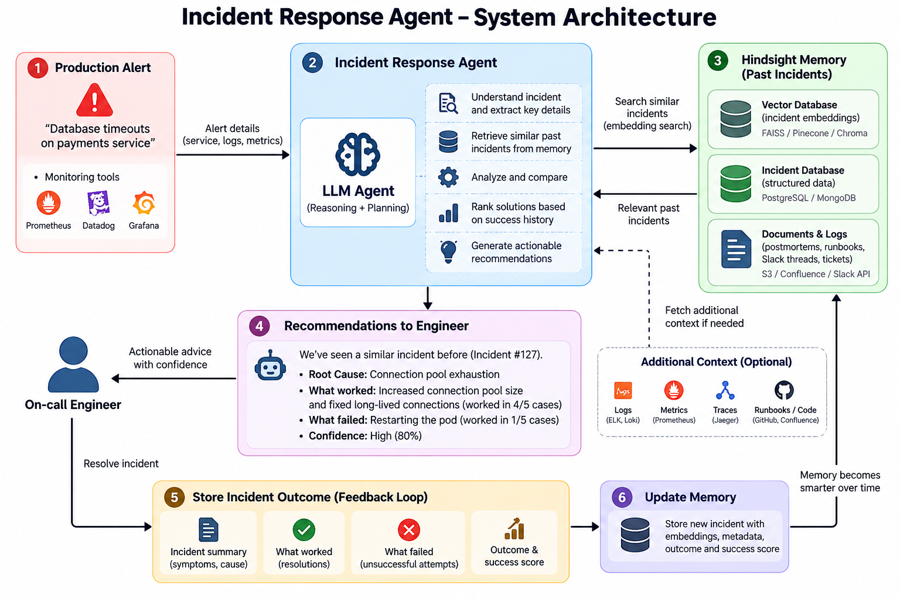

<div align="center">

# 🛡️ Incident Response Agent (IRA)
### *Autonomous Incident Triage & Organizational Memory Engine for Site Reliability Engineers*

[](https://nextjs.org/)
[](https://react.dev/)
[](https://www.typescriptlang.org/)
[](https://tailwindcss.com/)
[](https://www.sqlite.org/)
[](https://groq.com/)
[](LICENSE)

<br/>

**Incident Response Agent (IRA)** is an AI-powered assistant designed for on-call Site Reliability Engineers (SREs) and DevOps teams. Unlike general-purpose AI chat tools that have zero memory of your infrastructure, IRA is grounded in persistent organizational memory (**The Hindsight Engine**). It recalls past production outages, ranks verified mitigations by empirical success rates, and strictly prevents teams from repeating catastrophic mistakes by quarantining failed actions into **"What NOT to Do"**.

</div>

---

## 📑 Table of Contents

- [The SRE Memory Problem](#-the-sre-memory-problem)
- [Key Innovations & Features](#-key-innovations--features)
- [System Architecture & Workflow](#-system-architecture--workflow)
- [Interactive UI Showcase](#-interactive-ui-showcase)
- [Quickstart Guide](#-quickstart-guide)
  - [Prerequisites](#prerequisites)
  - [1. Clone \& Install Dependencies](#1-clone--install-dependencies)
  - [2. Configure Environment Variables](#2-configure-environment-variables)
  - [3. Start the Development Server](#3-start-the-development-server)
  - [4. Run Verification Tests](#4-run-verification-tests)
- [API Reference](#-api-reference)
- [Project Directory Structure](#-project-directory-structure)
- [Technology Stack](#-technology-stack)
- [Contributing \& License](#-contributing--license)

---

## 🛑 The SRE Memory Problem

When production outages strike at 3:00 AM, engineers face critical dilemmas:

1. **Amnesia in Modern AI**: Standard LLMs suggest generic runbook actions (e.g., `kubectl rollout restart deployment/...`). During connection pool exhaustion or cache stampedes, blind pod restarts trigger cold-start thundering herds that take down upstream databases.
2. **Repeating Past Failures**: In postmortems, teams document what failed, but that knowledge gets buried in wikis. New or sleepy on-call engineers attempt the exact same failed mitigations again.
3. **Deceptive Twin Incidents**: Two alerts may present identical surface symptoms (e.g., *Database query timeouts*), but one was caused by an unclosed connection leak while the other is a Redis cache eviction storm. Blindly applying past fixes without telemetry validation causes cascading downtime.

---

## ✨ Key Innovations & Features

### 🧠 1. Persistent Organizational Memory (The Hindsight Engine)
- Retains verified postmortems, alert signatures, telemetry profiles, commands, and empirical resolution timings across restarts using built-in SQLite and dual-synchronized JSON storage.
- Recognizes recurring incidents and follow-up queries instantly, answering directly from empirical institutional memory.

### 🚫 2. Strict Anti-Pattern Quarantine ("What NOT to Do")
- When an engineer tests a mitigation and marks it as **"Didn't work"**, IRA **permanently removes it** from verified fixes and adds it to the **"What NOT to Do"** anti-patterns archive.
- Never suggests a failed mitigation again. Every anti-pattern displays its danger level (`HIGH`, `CRITICAL`) along with historical consequence notes explaining why it failed.

### 📊 3. Empirical Success Ranking & MTTR Scoring
- Verified solutions are ranked by real-world success percentages and mean time to resolution (MTTR).
- Distinguishes between brand new zero-day incidents (dynamic AI diagnosis without fabricated scores) and battle-tested historical playbooks.

### ⚡ 4. Real-Time Telemetry Divergence Detection
- Cross-references incoming metrics (DB connections, CPU, memory, queue depth) against historical baselines.
- Flags **Divergence Risks** when an alert mimics a known issue but real-time telemetry conflicts with the historical profile.

### 🔄 5. Live Interactive Feedback Loop
- On-call engineers can click **"Worked"** or **"Didn't work"** directly in the chat triage cards.
- Supports conversational feedback (e.g., *"option 1 worked"*, *"didn't work because server remained saturated"*), dynamically updating memory in real time.

### 📑 6. Instant Postmortem Generator
- One-click postmortem generation outputting clean GitHub-flavored markdown with timeline, root cause, verified solutions, and tracked anti-patterns.

### ⚔️ 7. Baseline vs. Hindsight Contrast Evaluation
- Real-time side-by-side evaluation contrasting a zero-memory AI agent against IRA with Hindsight, showing up to a **~92% MTTR reduction** (from 45 minutes down to ~3.5 minutes).

---

## 🏗️ System Architecture & Workflow



---

## 🖥️ Interactive UI Showcase

```text
┌─────────────────────────────────────────────────────────────────────────────┐
│ 🛡️ Incident Response Agent                 [● Memory Active] [Postmortems] │
├─────────────────────────────────────────────────────────────────────────────┤
│ 👤 User: My RAG application is facing severe load issues and DB bottlenecks │
│                                                                             │
│ 🤖 IRA: 🎯 Answered Directly from Memory & Past Experience (INC-959)!      │
│                                                                             │
│ ┌─ #1 Implement request queue to decouple processing ─── [100% Success] ──┐ │
│ │  $ kubectl apply -f request-queue-config.yaml                       [📋] │ │
│ │  Did this mitigation work?                      [👍 Worked] [👎 Failed] │ │
│ └─────────────────────────────────────────────────────────────────────────┘ │
│                                                                             │
│ ┌─ 🚫 What NOT to Do (Proven to fail in past experience with this incident)┐ │
│ │  Avoid: Optimize database connection pooling              [HIGH RISK]   │ │
│ │  $ kubectl exec -it db-pod -- psql -c "ALTER SYSTEM SET max_conn=200;"   │ │
│ │  Past consequence: Simply increasing pool didn't reduce server load     │ │
│ └─────────────────────────────────────────────────────────────────────────┘ │
└─────────────────────────────────────────────────────────────────────────────┘
```

---

## 🚀 Quickstart Guide

### Prerequisites
- **Node.js**: v18.0.0 or higher
- **npm**: v9.0.0 or higher
- *(Optional)* **Python**: 3.10+ (if utilizing optional Python scripts/APIs)

---

### 1. Clone & Install Dependencies

```bash
# Clone the repository
git clone https://github.com/Sanju562586/Incident-Response-Agent.git
cd Incident-Response-Agent

# Install frontend dependencies
cd frontend
npm install
```

---

### 2. Configure Environment Variables

Create a `.env.local` file inside the `frontend/` directory (you can copy `.env.example`):

```bash
cp ../.env.example .env.local
```

Populate one of the following LLM provider keys:

```ini
# Option 1: Groq API (Ultra-fast, Recommended)
GROQ_API_KEY=gsk_your_groq_api_key_here
GROQ_MODEL=llama-3.3-70b-versatile

# Option 2: Google Gemini
# GEMINI_API_KEY=your_gemini_api_key_here

# Option 3: OpenAI
# OPENAI_API_KEY=sk-your_openai_key_here
# OPENAI_MODEL=gpt-4o-mini
```

> **Tip:** You can obtain a free Groq API key at [console.groq.com/keys](https://console.groq.com/keys).

---

### 3. Start the Development Server

From the `frontend/` directory:

```bash
npm run dev
```

Open your browser and navigate to:
```
http://localhost:3000
```

---

### 4. Run Verification Tests

To run the unit test suite verifying semantic recall, divergence detection, failure quarantine, and MTTR ranking:

```bash
# Run from the project root
node tests/hindsight.test.js
```

Expected output:
```text
🧪 Starting Incident Response Agent (IRA) Test Suite...
✅ HindsightEngine initialized with 1 incidents.
--- Test 1: Query Alert Recall ---
Matched: INC-402 (Payment Gateway DB Connection Saturation) with 90% confidence
--- Test 2: Mitigation Ranking & Red Herring Flagging ---
Verified Fix #1: Drain idle connections and bump pool capacity (Empirical Score: 95%)
Tracked Red Herring #1: Rolling restart of payments deployment (Failed 5 times, Danger: CRITICAL)
--- Test 3: Divergence Detection (Cache Storm vs DB Pool) ---
Divergence Alert Output: ⚠️ DIVERGENCE DETECTED...
--- Test 4: Before / After Contrast Evaluation ---
Zero-Memory AI Estimated MTTR: 45 minutes
IRA with Hindsight MTTR: 3.5 minutes (MTTR Reduction: 92%)
--- Test 5: Interactive Feedback Recording ---
Updated Action Times Worked: 4
🎉 ALL TESTS PASSED! Incident Response Agent (IRA) core logic verified.
```

---

## 🔌 API Reference

| Endpoint | Method | Description |
| :--- | :--- | :--- |
| `/api/chat` | `POST` | Primary conversational triage endpoint. Analyzes alerts, checks memory, and returns ranked mitigations and anti-patterns. |
| `/api/mitigations/feedback` | `POST` | Submits feedback (`worked` / `failed`). Automatically removes failed fixes from suggestions and records anti-patterns. |
| `/api/compare` | `POST` | Side-by-side benchmark comparing zero-memory LLM analysis against IRA with Hindsight memory. |
| `/api/incidents` | `GET` / `POST` / `DELETE` | Retrieve, save, or wipe organizational incident postmortems in persistent memory. |
| `/api/postmortem/:id` | `GET` | Generates a structured markdown postmortem report for a specific incident. |
| `/api/search` | `POST` | Queries the Hindsight memory engine directly for matching incidents and telemetry comparisons. |

---

## 📁 Project Directory Structure

```text
Incident-Response-Agent/
├── .env.example                     # Environment template for LLM keys
├── requirements.txt                 # Python dependencies (APIs, LLMs, testing)
├── data/
│   └── incidents.json               # Root persistent postmortem storage
├── engine/
│   ├── hindsight.js                 # Core Hindsight organizational memory engine
│   └── generic_agent.js             # Zero-memory baseline agent for contrast benchmarks
├── tests/
│   ├── hindsight.test.js            # Engine verification & divergence test suite
│   └── test_incidents.json          # Mock test fixture
└── frontend/                        # Next.js 16 (App Router) Web Application
    ├── src/
    │   ├── app/
    │   │   ├── page.tsx             # Interactive on-call triage console UI
    │   │   ├── layout.tsx           # Global layout & metadata
    │   │   ├── globals.css          # Tailwind CSS styling
    │   │   └── api/                 # Next.js Serverless API routes
    │   │       ├── chat/route.ts
    │   │       ├── compare/route.ts
    │   │       ├── incidents/route.ts
    │   │       ├── mitigations/feedback/route.ts
    │   │       ├── postmortem/[id]/route.ts
    │   │       └── search/route.ts
    │   └── lib/
    │       ├── db.ts                # Dual-layer SQLite & JSON persistence layer
    │       ├── hindsight.ts         # TypeScript Hindsight engine integration
    │       ├── llm.ts               # Dynamic multi-provider LLM interface (Groq/Gemini/OpenAI)
    │       ├── generic-agent.ts     # Baseline comparison agent
    │       ├── types.ts             # TypeScript interfaces (Incident, Mitigation, RedHerring)
    │       └── data/
    │           └── incidents.json   # Frontend persistent incident store
    ├── package.json
    └── tsconfig.json
```

---

## 🛠️ Technology Stack

- **Frontend & App Framework**: [Next.js 16](https://nextjs.org/) (App Router, Turbopack) & [React 19](https://react.dev/)
- **Styling & Components**: [Tailwind CSS v4](https://tailwindcss.com/) & [Lucide React](https://lucide.dev/)
- **Language**: [TypeScript 5](https://www.typescriptlang.org/)
- **Data Persistence**: Built-in Node SQLite (`node:sqlite`) with automatic fallback to JSON flat-file storage
- **AI / LLM Providers**: [Groq SDK](https://groq.com/) (LLaMA 3.3 70B Versatile), [Google Generative AI](https://aistudio.google.com/) (Gemini 1.5/2.0), [OpenAI](https://openai.com/)
- **Testing**: Node.js assert & Pytest

---

## 🤝 Contributing & License

Contributions, issues, and feature requests are welcome! Feel free to check the [issues page](https://github.com/Sanju562586/Incident-Response-Agent/issues).

Distributed under the **MIT License**. See `LICENSE` for more information.

<div align="center">
  <sub>Built with ❤️ for reliability engineers who never want to repeat the same 3:00 AM outage twice.</sub>
</div>
